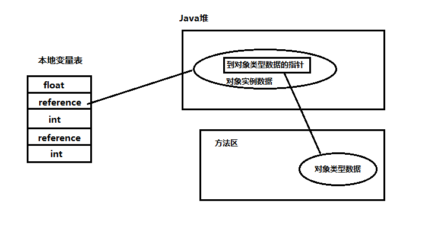

## Java内存模型 JMM

Java采用的是基于共享内存的并发模型,使得JVM看起来非常类似现代多核处理器:在基于共享内存的多核处理器体系架构中,每个处理器都有自己的缓存,并且定期与主内存进行协调.这里的线程同样有自己的缓存(也叫工作内存),此时,JVM内存模型呈现出如下结构:


上图展示JVM的内存模型,也称之为JMM.对于JMM有以下规定:

1. 所有的变量都存储在主内存(Main Memory)
2. 每个线程也有用自己的工作内存(Work Memory)
3. 工作内存中的变量是主内存变量的拷贝,线程不能直接读写主内存的变量,而只能操作自己工作内存中的变量
4. 线程间不共享工作内存,如果线程间需要通信必须借助主内存来完成

参考文章:[不一样的视角：从JVM内存模型谈线程安全](https://blog.csdn.net/dd864140130/article/details/58359102)

## Java运行时数据区域

Java虚拟机在执行Java程序的过程中会将其管理的内存划分为若干个不同的数据区域，这些区域有各自的用途、创建和销毁的时间，有些区域随虚拟机进程的启动而存在，有些区域则是依赖用户线程的启动和结束来建立和销毁。Java虚拟机所管理的内存包括以下几个运行时数据区域，如图：


**1、程序计数器**：指向当前线程正在执行的字节码指令。线程私有的。


**2、虚拟机栈**：虚拟机栈是Java执行方法的内存模型。每个方法被执行的时候，都会创建一个栈帧，把栈帧压人栈，当方法正常返回或者抛出未捕获的异常时，栈帧就会出栈。

- 栈帧：栈帧存储方法的相关信息，包含局部变量数表、返回值、操作数栈、动态链接

  - 局部变量表：包含了方法执行过程中的所有变量。局部变量数组所需要的空间在编译期间完成分配，在方法运行期间不会改变局部变量数组的大小。

  - 返回值：如果有返回值的话，压入调用者栈帧中的操作数栈中，并且把PC的值指向 方法调用指令 后面的一条指令地址。

  - 操作数栈：操作变量的内存模型。操作数栈的最大深度在编译的时候已经确定（写入方法区code属性的max_stacks项中）。操作数栈的的元素可以是任意Java类型，包括long和double，32位数据占用栈空间为1，64位数据占用2。方法刚开始执行的时候，栈是空的，当方法执行过程中，各种字节码指令往栈中存取数据。

  - 操作数栈：操作变量的内存模型。操作数栈的最大深度在编译的时候已经确定（写入方法区code属性的max_stacks项中）。操作数栈的的元素可以是任意Java类型，包括long和double，32位数据占用栈空间为1，64位数据占用2。方法刚开始执行的时候，栈是空的，当方法执行过程中，各种字节码指令往栈中存取数据。

  - 动态链接：每个栈帧都持有在运行时常量池中该栈帧所属方法的引用，持有这个引用是为了支持方法调用过程中的动态链接。

**3、本地方法栈**：和虚拟机栈所发挥的作用非常相似，区别是： **虚拟机栈为虚拟机执行Java方法 （也就是字节码）服务，而本地方法栈则为虚拟机使用到的Native方法服务。** 在HotSpot虚拟机中和Java虚拟机栈合二为一。

**4、方法区**：用于存储已被虚拟机加载的类信息、常量、静态变量、即时编译后的代码等数据

**运行时常量池**：运行时常量池是方法区的一部分。Class 文件中除了有类的版本、字段、方法、接口等描述信息外，还有常量池信息（用于存放编译期生成的各种字面量和符号引用）既然运行时常量池时方法区的一部分，自然受到方法区内存的限制，当常量池无法再申请到内存时会抛出 OutOfMemoryError 异常。

**JDK1.7及之后版本的 JVM 已经将运行时常量池从方法区中移了出来，在 Java 堆（Heap）中开辟了一块区域存放运行时常量池。同时在 jdk 1.8中移除整个永久代，取而代之的是一个叫元空间（Metaspace）的区域**

**5、堆（Heap）**：Java 虚拟机所管理的内存中最大的一块，Java 堆是所有线程共享的一块内存区域，在虚拟机启动时创建。**此内存区域的唯一目的就是存放对象实例，几乎所有的对象实例以及数组都在这里分配内存。**

Java 堆是垃圾收集器管理的主要区域，因此也被称作**GC堆（Garbage Collected Heap）**.从垃圾回收的角度，由于现在收集器基本都采用分代垃圾收集算法，所以Java堆还可以细分为：新生代和老年代：再细致一点有：Eden空间、From Survivor、To Survivor空间等。**进一步划分的目的是更好地回收内存，或者更快地分配内存。**

**6、直接内存**：**直接内存并不是虚拟机运行时数据区的一部分，也不是虚拟机规范中定义的内存区域，但是这部分内存也被频繁地使用。而且也可能导致 OutOfMemoryError 异常出现。**

JDK1.4 中新加入的 **NIO(New Input/Output) 类**，引入了一种基于**通道（Channel）** 与**缓存区（Buffer）** 的 I/O 方式，它可以直接使用 Native 函数库直接分配堆外内存，然后通过一个存储在 Java 堆中的 DirectByteBuffer 对象作为这块内存的引用进行操作。这样就能在一些场景中显著提高性能，因为**避免了在 Java 堆和 Native 堆之间来回复制数据**。

本机直接内存的分配不会收到 Java 堆的限制，但是，既然是内存就会受到本机总内存大小以及处理器寻址空间的限制。

参考文章

- [JVM 史上最最最完整深入解析](https://mp.weixin.qq.com/s/cHpEphIVv56dw3VWKqBIWw)

- [听说又被 JVM 内存区域方面的面试题给虐了？](https://mp.weixin.qq.com/s/TpCElutqVSt7PAzjrGz12w)

## 堆内存划分

Java堆的内存划分如图所示，分别为年轻代、Old Memory（老年代）、Perm（永久代）。其中在Jdk1.8中，永久代被移除，使用MetaSpace代替。


## 如何定位垃圾

- ### 引用计数算法

  为对象添加一个引用计数器，当对象增加一个引用时计数器加 1，引用失效时计数器减 1。引用计数为 0 的对象可被回收。

  在两个对象出现循环引用的情况下，此时引用计数器永远不为 0，导致无法对它们进行回收。正是因为循环引用的存在，因此 Java 虚拟机不使用引用计数算法。

- ###可达性分析算法

  以 GC Roots 为起始点进行搜索，可达的对象都是存活的，不可达的对象可被回收。

  Java 虚拟机使用该算法来判断对象是否可被回收，GC Roots 一般包含以下内容：

  - 虚拟机栈中局部变量表中引用的对象
  - 本地方法栈中 JNI 中引用的对象
  - 方法区中类静态属性引用的对象
  - 方法区中的常量引用的对象

## 垃圾回收算法

- 复制 (copying) - 没有碎片，浪费空间
- 标记整理(mark compact) - 没有碎片，效率偏低（两遍扫描，指针需要调整）
- 标记清除(mark sweep) - 位置不连续 产生碎片 效率偏低（两遍扫描）


## 垃圾收集器


以上是 HotSpot 虚拟机中的 7 个垃圾收集器，连线表示垃圾收集器可以配合使用。

- 单线程与多线程：单线程指的是垃圾收集器只使用一个线程，而多线程使用多个线程；
- 串行与并行：串行指的是垃圾收集器与用户程序交替执行，这意味着在执行垃圾收集的时候需要停顿用户程序；并行指的是垃圾收集器和用户程序同时执行。除了 CMS 和 G1 之外，其它垃圾收集器都是以串行的方式执行。

### 1. Serial 收集器

它是单线程的收集器，只会使用一个线程进行垃圾收集工作。

它的优点是简单高效，在单个 CPU 环境下，由于没有线程交互的开销，因此拥有最高的单线程收集效率。

它是 Client 场景下的默认新生代收集器，因为在该场景下内存一般来说不会很大。它收集一两百兆垃圾的停顿时间可以控制在一百多毫秒以内，只要不是太频繁，这点停顿时间是可以接受的。

### 2. ParNew 收集器

 Serial 收集器的多线程版本。除了性能原因外，主要是因为除了 Serial 收集器，只有它能与 CMS 收集器配合使用。

### 3. Parallel Scavenge 收集器

与 ParNew 一样是多线程收集器。

其它收集器目标是尽可能缩短垃圾收集时用户线程的停顿时间，而它的目标是达到一个可控制的吞吐量，因此它被称为“吞吐量优先”收集器。这里的吞吐量指 CPU 用于运行用户程序的时间占总时间的比值。

停顿时间越短就越适合需要与用户交互的程序，良好的响应速度能提升用户体验。而高吞吐量则可以高效率地利用 CPU 时间，尽快完成程序的运算任务，适合在后台运算而不需要太多交互的任务。

缩短停顿时间是以牺牲吞吐量和新生代空间来换取的：新生代空间变小，垃圾回收变得频繁，导致吞吐量下降。

可以通过一个开关参数打开 GC 自适应的调节策略（GC Ergonomics），就不需要手工指定新生代的大小（-Xmn）、Eden 和 Survivor 区的比例、晋升老年代对象年龄等细节参数了。虚拟机会根据当前系统的运行情况收集性能监控信息，动态调整这些参数以提供最合适的停顿时间或者最大的吞吐量。

### 4. Serial Old 收集器

 Serial 收集器的老年代版本，也是给 Client 场景下的虚拟机使用。如果用在 Server 场景下，它有两大用途：

- 在 JDK 1.5 以及之前版本（Parallel Old 诞生以前）中与 Parallel Scavenge 收集器搭配使用。
- 作为 CMS 收集器的后备预案，在并发收集发生 Concurrent Mode Failure 时使用。

### 5. Parallel Old 收集器

是 Parallel Scavenge 收集器的老年代版本。

在注重吞吐量以及 CPU 资源敏感的场合，都可以优先考虑 Parallel Scavenge 加 Parallel Old 收集器。

### 6. CMS 收集器

CMS（Concurrent Mark Sweep），Mark Sweep 指的是标记 - 清除算法。算法：三色标记 + Incremental Update

分为以下四个流程：

- 初始标记：仅仅只是标记一下 GC Roots 能直接关联到的对象，速度很快，需要停顿。
- 并发标记：进行 GC Roots Tracing 的过程，它在整个回收过程中耗时最长，不需要停顿。
- 重新标记：为了修正并发标记期间因用户程序继续运作而导致标记产生变动的那一部分对象的标记记录，需要停顿。
- 并发清除：不需要停顿。

在整个过程中耗时最长的并发标记和并发清除过程中，收集器线程都可以与用户线程一起工作，不需要进行停顿。

具有以下缺点：

- 吞吐量低：低停顿时间是以牺牲吞吐量为代价的，导致 CPU 利用率不够高。
- 无法处理浮动垃圾，可能出现 Concurrent Mode Failure。浮动垃圾是指并发清除阶段由于用户线程继续运行而产生的垃圾，这部分垃圾只能到下一次 GC 时才能进行回收。由于浮动垃圾的存在，因此需要预留出一部分内存，意味着 CMS 收集不能像其它收集器那样等待老年代快满的时候再回收。如果预留的内存不够存放浮动垃圾，就会出现 Concurrent Mode Failure，这时虚拟机将临时启用 Serial Old 来替代 CMS。
- 标记 - 清除算法导致的空间碎片，往往出现老年代空间剩余，但无法找到足够大连续空间来分配当前对象，不得不提前触发一次 Full GC。

### 7. G1 收集器

G1（Garbage-First）算法：三色标记 + SATB，它是一款面向服务端应用的垃圾收集器，在多 CPU 和大内存的场景下有很好的性能。HotSpot 开发团队赋予它的使命是未来可以替换掉 CMS 收集器。

堆被分为新生代和老年代，其它收集器进行收集的范围都是整个新生代或者老年代，而 G1 可以直接对新生代和老年代一起回收。

G1 把堆划分成多个大小相等的独立区域（Region），新生代和老年代不再物理隔离。


通过引入 Region 的概念，从而将原来的一整块内存空间划分成多个的小空间，使得每个小空间可以单独进行垃圾回收。这种划分方法带来了很大的灵活性，使得可预测的停顿时间模型成为可能。通过记录每个 Region 垃圾回收时间以及回收所获得的空间（这两个值是通过过去回收的经验获得），并维护一个优先列表，每次根据允许的收集时间，优先回收价值最大的 Region。

每个 Region 都有一个 Remembered Set，用来记录该 Region 对象的引用对象所在的 Region。通过使用 Remembered Set，在做可达性分析的时候就可以避免全堆扫描。

如果不计算维护 Remembered Set 的操作，G1 收集器的运作大致可划分为以下几个步骤：

- 初始标记
- 并发标记
- 最终标记：为了修正在并发标记期间因用户程序继续运作而导致标记产生变动的那一部分标记记录，虚拟机将这段时间对象变化记录在线程的 Remembered Set Logs 里面，最终标记阶段需要把 Remembered Set Logs 的数据合并到 Remembered Set 中。这阶段需要停顿线程，但是可并行执行。
- 筛选回收：首先对各个 Region 中的回收价值和成本进行排序，根据用户所期望的 GC 停顿时间来制定回收计划。此阶段其实也可以做到与用户程序一起并发执行，但是因为只回收一部分 Region，时间是用户可控制的，而且停顿用户线程将大幅度提高收集效率。

具备如下特点：

- 空间整合：整体来看是基于“标记 - 整理”算法实现的收集器，从局部（两个 Region 之间）上来看是基于“复制”算法实现的，这意味着运行期间不会产生内存空间碎片。
- 可预测的停顿：能让使用者明确指定在一个长度为 M 毫秒的时间片段内，消耗在 GC 上的时间不得超过 N 毫秒。

**8、ZGC**

算法：ColoredPointers + LoadBarrier

**9、Shenandoah**
算法：ColoredPointers + WriteBarrier


## 内存分配策略

### 1. 对象优先在 Eden 分配

大多数情况下，对象在新生代 Eden 区分配，当 Eden 区空间不够时，发起 Minor GC。

### 2. 大对象直接进入老年代

大对象是指需要连续内存空间的对象，最典型的大对象是那种很长的字符串以及数组。

经常出现大对象会提前触发垃圾收集以获取足够的连续空间分配给大对象。

-XX:PretenureSizeThreshold，大于此值的对象直接在老年代分配，避免在 Eden 区和 Survivor 区之间的大量内存复制。

### 3. 长期存活的对象进入老年代

为对象定义年龄计数器，对象在 Eden 出生并经过 Minor GC 依然存活，将移动到 Survivor 中，年龄就增加 1 岁，增加到一定年龄则移动到老年代中。

-XX:MaxTenuringThreshold 用来定义年龄的阈值。

### 4. 动态对象年龄判定

虚拟机并不是永远地要求对象的年龄必须达到 MaxTenuringThreshold 才能晋升老年代，如果在 Survivor 中相同年龄所有对象大小的总和大于 Survivor 空间的一半，则年龄大于或等于该年龄的对象可以直接进入老年代，无需等到 MaxTenuringThreshold 中要求的年龄。

### 5. 空间分配担保

在发生 Minor GC 之前，虚拟机先检查老年代最大可用的连续空间是否大于新生代所有对象总空间，如果条件成立的话，那么 Minor GC 可以确认是安全的。

如果不成立的话虚拟机会查看 HandlePromotionFailure 设置值是否允许担保失败，如果允许那么就会继续检查老年代最大可用的连续空间是否大于历次晋升到老年代对象的平均大小，如果大于，将尝试着进行一次 Minor GC；如果小于，或者 HandlePromotionFailure 设置不允许冒险，那么就要进行一次 Full GC。


## Full GC 的触发条件

对于 Minor GC，其触发条件非常简单，当 Eden 空间满时，就将触发一次 Minor GC。而 Full GC 则相对复杂，有以下条件：

### 1. 调用 System.gc()

只是建议虚拟机执行 Full GC，但是虚拟机不一定真正去执行。不建议使用这种方式，而是让虚拟机管理内存。

### 2. 老年代空间不足

老年代空间不足的常见场景为前文所讲的大对象直接进入老年代、长期存活的对象进入老年代等。

为了避免以上原因引起的 Full GC，应当尽量不要创建过大的对象以及数组。除此之外，可以通过 -Xmn 虚拟机参数调大新生代的大小，让对象尽量在新生代被回收掉，不进入老年代。还可以通过 -XX:MaxTenuringThreshold 调大对象进入老年代的年龄，让对象在新生代多存活一段时间。

### 3. 空间分配担保失败

使用复制算法的 Minor GC 需要老年代的内存空间作担保，如果担保失败会执行一次 Full GC。具体内容请参考上面的第五小节。

### 4. JDK 1.7 及以前的永久代空间不足

在 JDK 1.7 及以前，HotSpot 虚拟机中的方法区是用永久代实现的，永久代中存放的为一些 Class 的信息、常量、静态变量等数据。

当系统中要加载的类、反射的类和调用的方法较多时，永久代可能会被占满，在未配置为采用 CMS GC 的情况下也会执行 Full GC。如果经过 Full GC 仍然回收不了，那么虚拟机会抛出 java.lang.OutOfMemoryError。

为避免以上原因引起的 Full GC，可采用的方法为增大永久代空间或转为使用 CMS GC。

### 5. Concurrent Mode Failure

执行 CMS GC 的过程中同时有对象要放入老年代，而此时老年代空间不足（可能是 GC 过程中浮动垃圾过多导致暂时性的空间不足），便会报 Concurrent Mode Failure 错误，并触发 Full GC。


## 类加载机制

类是在运行期间第一次使用时动态加载的，而不是一次性加载。因为如果一次性加载，那么会占用很多的内存。

## 类的生命周期


包括以下 7 个阶段：

- **加载（Loading）**
- **验证（Verification）**
- **准备（Preparation）**
- **解析（Resolution）**
- **初始化（Initialization）**
- 使用（Using）
- 卸载（Unloading）

## 类加载过程

包含了加载、验证、准备、解析和初始化这 5 个阶段。

### 1. 加载

加载是类加载的一个阶段，注意不要混淆。

加载过程完成以下三件事：

- 通过类的完全限定名称获取定义该类的二进制字节流。
- 将该字节流表示的静态存储结构转换为方法区的运行时存储结构。
- 在内存中生成一个代表该类的 Class 对象，作为方法区中该类各种数据的访问入口。

其中二进制字节流可以从以下方式中获取：

- 从 ZIP 包读取，成为 JAR、EAR、WAR 格式的基础。
- 从网络中获取，最典型的应用是 Applet。
- 运行时计算生成，例如动态代理技术，在 java.lang.reflect.Proxy 使用 ProxyGenerator.generateProxyClass 的代理类的二进制字节流。
- 由其他文件生成，例如由 JSP 文件生成对应的 Class 类。

### 2. 验证

确保 Class 文件的字节流中包含的信息符合当前虚拟机的要求，并且不会危害虚拟机自身的安全。

### 3. 准备

类变量是被 static 修饰的变量，准备阶段为类变量分配内存并设置初始值，使用的是方法区的内存。

实例变量不会在这阶段分配内存，它会在对象实例化时随着对象一起被分配在堆中。应该注意到，实例化不是类加载的一个过程，类加载发生在所有实例化操作之前，并且类加载只进行一次，实例化可以进行多次。

初始值一般为 0 值，例如下面的类变量 value 被初始化为 0 而不是 123。

```
public static int value = 123;
```

如果类变量是常量，那么它将初始化为表达式所定义的值而不是 0。例如下面的常量 value 被初始化为 123 而不是 0。

```
public static final int value = 123;
```

### 4. 解析

将常量池的符号引用替换为直接引用的过程。

其中解析过程在某些情况下可以在初始化阶段之后再开始，这是为了支持 Java 的动态绑定。

### 5. 初始化

初始化阶段才真正开始执行类中定义的 Java 程序代码。初始化阶段是虚拟机执行类构造器 <clinit>() 方法的过程。在准备阶段，类变量已经赋过一次系统要求的初始值，而在初始化阶段，根据程序员通过程序制定的主观计划去初始化类变量和其它资源。

在准备阶段，已经为类变量分配了系统所需的初始值，并且在初始化阶段，根据程序员通过程序进行的主观计划来初始化类变量和其他资源。

<clinit>() 是由编译器自动收集类中所有类变量的赋值动作和静态语句块中的语句合并产生的，编译器收集的顺序由语句在源文件中出现的顺序决定。特别注意的是，静态语句块只能访问到定义在它之前的类变量，定义在它之后的类变量只能赋值，不能访问。例如以下代码：

```java
public class Test {    
  static {        
    i = 0;                // 给变量赋值可以正常编译通过        
    System.out.print(i);  // 这句编译器会提示“非法向前引用”    
  }    
  static int i = 1;
}
```

由于父类的 <clinit>() 方法先执行，也就意味着父类中定义的静态语句块的执行要优先于子类。例如以下代码：

```java
static class Parent {    
  public static int A = 1;    
  static {        
    A = 2;    
  }
}
static class Sub extends Parent {    
  public static int B = A;
}
public static void main(String[] args) {
  System.out.println(Sub.B);  // 2
}
```

接口中不可以使用静态语句块，但仍然有类变量初始化的赋值操作，因此接口与类一样都会生成 <clinit>() 方法。但接口与类不同的是，执行接口的 <clinit>() 方法不需要先执行父接口的 <clinit>() 方法。只有当父接口中定义的变量使用时，父接口才会初始化。另外，接口的实现类在初始化时也一样不会执行接口的 <clinit>() 方法。

虚拟机会保证一个类的 <clinit>() 方法在多线程环境下被正确的加锁和同步，如果多个线程同时初始化一个类，只会有一个线程执行这个类的 <clinit>() 方法，其它线程都会阻塞等待，直到活动线程执行 <clinit>() 方法完毕。如果在一个类的 <clinit>() 方法中有耗时的操作，就可能造成多个线程阻塞，在实际过程中此种阻塞很隐蔽。

### 对象的访问定位

建立对象就是为了使用对象，我们的Java程序通过栈上的 reference 数据来操作堆上的具体对象。对象的访问方式有虚拟机实现而定，目前主流的访问方式有**①使用句柄**和**②直接指针**两种：

•**句柄：** 如果使用句柄的话，那么Java堆中将会划分出一块内存来作为句柄池，reference 中存储的就是对象的句柄地址，而句柄中包含了对象实例数据与类型数据各自的具体地址信息；


- **直接指针**：如果使用直接指针访问，那么 Java 堆对象的布局中就必须考虑如何放置访问类型数据的相关信息，而reference 中存储的直接就是对象的地址。



**这两种对象访问方式各有优势。使用句柄来访问的最大好处是 reference 中存储的是稳定的句柄地址，在对象被移动时只会改变句柄中的实例数据指针，而 reference 本身不需要修改。使用直接指针访问方式最大的好处就是速度快，它节省了一次指针定位的时间开销。**

## 类初始化时机

### 1. 主动引用

虚拟机规范中并没有强制约束何时进行加载，但是规范严格规定了有且只有下列五种情况必须对类进行初始化（加载、验证、准备都会随之发生）：

- 遇到 new、getstatic、putstatic、invokestatic 这四条字节码指令时，如果类没有进行过初始化，则必须先触发其初始化。最常见的生成这 4 条指令的场景是：使用 new 关键字实例化对象的时候；读取或设置一个类的静态字段（被 final 修饰、已在编译期把结果放入常量池的静态字段除外）的时候；以及调用一个类的静态方法的时候。

- 使用 java.lang.reflect 包的方法对类进行反射调用的时候，如果类没有进行初始化，则需要先触发其初始化。

- 当初始化一个类的时候，如果发现其父类还没有进行过初始化，则需要先触发其父类的初始化。

- 当虚拟机启动时，用户需要指定一个要执行的主类（包含 main() 方法的那个类），虚拟机会先初始化这个主类；

- 当使用 JDK 1.7 的动态语言支持时，如果一个 java.lang.invoke.MethodHandle 实例最后的解析结果为 REFgetStatic, REFputStatic, REF_invokeStatic 的方法句柄，并且这个方法句柄所对应的类没有进行过初始化，则需要先触发其初始化；

  

### 2. 被动引用

以上 5 种场景中的行为称为对一个类进行主动引用。除此之外，所有引用类的方式都不会触发初始化，称为被动引用。被动引用的常见例子包括：

- 通过子类引用父类的静态字段，不会导致子类初始化。

```java
System.out.println(SubClass.value);  // value 字段在 SuperClass 中定义
```

- 通过数组定义来引用类，不会触发此类的初始化。该过程会对数组类进行初始化，数组类是一个由虚拟机自动生成的、直接继承自 Object 的子类，其中包含了数组的属性和方法。

```java
SuperClass[] sca = new SuperClass[10];
```

- 常量在编译阶段会存入调用类的常量池中，本质上并没有直接引用到定义常量的类，因此不会触发定义常量的类的初始化。

```java
System.out.println(ConstClass.HELLOWORLD);
```

## 类与类加载器

两个类相等，需要类本身相等，并且使用同一个类加载器进行加载。这是因为每一个类加载器都拥有一个独立的类名称空间。

这里的相等，包括类的 Class 对象的 equals() 方法、isAssignableFrom() 方法、isInstance() 方法的返回结果为 true，也包括使用 instanceof 关键字做对象所属关系判定结果为 true。

## 类加载器分类

从 Java 虚拟机的角度来讲，只存在以下两种不同的类加载器：

- 启动类加载器（Bootstrap ClassLoader），使用 C++ 实现，是虚拟机自身的一部分；
- 所有其它类的加载器，使用 Java 实现，独立于虚拟机，继承自抽象类 java.lang.ClassLoader。

从 Java 开发人员的角度看，类加载器可以划分得更细致一些：

- 启动类加载器（Bootstrap ClassLoader）此类加载器负责将存放在 <JRE_HOME>lib 目录中的，或者被 -Xbootclasspath 参数所指定的路径中的，并且是虚拟机识别的（仅按照文件名识别，如 rt.jar，名字不符合的类库即使放在 lib 目录中也不会被加载）类库加载到虚拟机内存中。启动类加载器无法被 Java 程序直接引用，用户在编写自定义类加载器时，如果需要把加载请求委派给启动类加载器，直接使用 null 代替即可。
- 扩展类加载器（Extension ClassLoader）这个类加载器是由 ExtClassLoader（sun.misc.Launcher$ExtClassLoader）实现的。它负责将 <JAVA_HOME>/lib/ext 或者被 java.ext.dir 系统变量所指定路径中的所有类库加载到内存中，开发者可以直接使用扩展类加载器。
- 应用程序类加载器（Application ClassLoader）这个类加载器是由 AppClassLoader（sun.misc.Launcher$AppClassLoader）实现的。由于这个类加载器是 ClassLoader 中的 getSystemClassLoader() 方法的返回值，因此一般称为系统类加载器。它负责加载用户类路径（ClassPath）上所指定的类库，开发者可以直接使用这个类加载器，如果应用程序中没有自定义过自己的类加载器，一般情况下这个就是程序中默认的类加载器。

## 双亲委派模型

应用程序是由三种类加载器互相配合从而实现类加载，除此之外还可以加入自己定义的类加载器。

下图展示了类加载器之间的层次关系，称为双亲委派模型（Parents Delegation Model）。该模型要求除了顶层的启动类加载器外，其它的类加载器都要有自己的父类加载器。类加载器之间的父子关系一般通过组合关系（Composition）来实现，而不是继承关系（Inheritance）。


### 1. 工作过程

一个类加载器首先将类加载请求转发到父类加载器，只有当父类加载器无法完成时才尝试自己加载。

### 2. 好处

使得 Java 类随着它的类加载器一起具有一种带有优先级的层次关系，从而使得基础类得到统一。

例如 java.lang.Object 存放在 rt.jar 中，如果编写另外一个 java.lang.Object 并放到 ClassPath 中，程序可以编译通过。由于双亲委派模型的存在，所以在 rt.jar 中的 Object 比在 ClassPath 中的 Object 优先级更高，这是因为 rt.jar 中的 Object 使用的是启动类加载器，而 ClassPath 中的 Object 使用的是应用程序类加载器。rt.jar 中的 Object 优先级更高，那么程序中所有的 Object 都是这个 Object。

### 3. 实现

以下是抽象类 java.lang.ClassLoader 的代码片段，其中的 loadClass() 方法运行过程如下：先检查类是否已经加载过，如果没有则让父类加载器去加载。当父类加载器加载失败时抛出 ClassNotFoundException，此时尝试自己去加载。

```java
public abstract class ClassLoader {    
  // The parent class loader for delegation    
  private final ClassLoader parent;  
  public Class<?> loadClass(String name) throws ClassNotFoundException {       
    return loadClass(name, false);   
  }
  protected Class<?> loadClass(String name, boolean resolve) throws ClassNotFoundException {        
      synchronized (getClassLoadingLock(name)) {     
        // First, check if the class has already been loaded        
        Class<?> c = findLoadedClass(name);      
        if (c == null) {               
          try {    
            if (parent != null) {         
              c = parent.loadClass(name, false); 
            } else {                       
              c = findBootstrapClassOrNull(name); 
            }                
          } catch (ClassNotFoundException e) {    
            // ClassNotFoundException thrown if class not found     
            // from the non-null parent class loader         
          }
          if (c == null) {   
            // If still not found, then invoke findClass in order       
            // to find the class.             
            c = findClass(name);         
          }           
        }           
        if (resolve) { 
          resolveClass(c);  
        }          
        return c;     
      }  
    }
    protected Class<?> findClass(String name) throws ClassNotFoundException {  
      throw new ClassNotFoundException(name);   
    }
}
```

## 自定义类加载器实现

FileSystemClassLoader 是自定义类加载器，继承自 java.lang.ClassLoader，用于加载文件系统上的类。它首先根据类的全名在文件系统上查找类的字节代码文件（.class 文件），然后读取该文件内容，最后通过 defineClass() 方法来把这些字节代码转换成 java.lang.Class 类的实例。

java.lang.ClassLoader 的 loadClass() 实现了双亲委派模型的逻辑，自定义类加载器一般不去重写它，但是需要重写 findClass() 方法。

```java
public class FileSystemClassLoader extends ClassLoader {
    private String rootDir;
    public FileSystemClassLoader(String rootDir) { 
      this.rootDir = rootDir;    
    }
    protected Class<?> findClass(String name) throws ClassNotFoundException {   
      byte[] classData = getClassData(name);        
      if (classData == null) {           
        throw new ClassNotFoundException();       
      } else {            
        return defineClass(name, classData, 0, classData.length);       
      }    
    }
    private byte[] getClassData(String className) {    
      String path = classNameToPath(className);        
      try {           
        InputStream ins = new FileInputStream(path); 
        ByteArrayOutputStream baos = new ByteArrayOutputStream();
        int bufferSize = 4096;            
        byte[] buffer = new byte[bufferSize];           
        int bytesNumRead;           
        while ((bytesNumRead = ins.read(buffer)) != -1) { 
          baos.write(buffer, 0, bytesNumRead);           
        }            
        return baos.toByteArray();       
      } catch (IOException e) {     
        e.printStackTrace();       
      }     
      return null;    
    }
    private String classNameToPath(String className) { 
      return rootDir + File.separatorChar + className.replace('.', File.separatorChar) + ".class";    
    }
}
```

## 为什么需要双亲委派模型？

如果没有双亲委派，那么用户是不是可以**自己定义一个java.lang.Object的同名类**，**java.lang.String的同名类**，并把它放到ClassPath中,那么**类之间的比较结果及类的唯一性将无法保证**，因此，为什么需要双亲委派模型？**防止内存中出现多份同样的字节码**


## 常用的jvm配置项

-Xmn -Xms -Xmx -Xss
年轻代 最小堆 最大堆 栈空间
-XX:+UseTLAB
使用TLAB，默认打开
-XX:+PrintTLAB
打印TLAB的使用情况
-XX:TLABSize
设置TLAB大小
-XX:+DisableExplictGC
System.gc()不管用 ，FGC
-XX:+PrintGC
-XX:+PrintGCDetails
-XX:+PrintHeapAtGC
-XX:+PrintGCTimeStamps
-XX:+PrintGCApplicationConcurrentTime (低)
打印应用程序时间
-XX:+PrintGCApplicationStoppedTime （低）
打印暂停时长
-XX:+PrintReferenceGC （重要性低）
记录回收了多少种不同引用类型的引用
-verbose:class
类加载详细过程
-XX:+PrintVMOptions
-XX:+PrintFlagsFinal -XX:+PrintFlagsInitial
必须会用
-Xloggc:opt/log/gc.log
-XX:MaxTenuringThreshold
升代年龄，最大值15
锁自旋次数 -XX:PreBlockSpin 热点代码检测参数-XX:CompileThreshold 逃逸分析 标量替换 …
这些不建议设置
Parallel常用参数
-XX:SurvivorRatio
-XX:PreTenureSizeThreshold
大对象到底多大
-XX:MaxTenuringThreshold
-XX:+ParallelGCThreads
并行收集器的线程数，同样适用于CMS，一般设为和CPU核数相同
-XX:+UseAdaptiveSizePolicy
自动选择各区大小比例

## CMS常用参数
-XX:+UseConcMarkSweepGC
-XX:ParallelCMSThreads
CMS线程数量
-XX:CMSInitiatingOccupancyFraction
使用多少比例的老年代后开始CMS收集，默认是68%(近似值)，如果频繁发生SerialOld卡顿，应该调小，（频繁CMS回收）
-XX:+UseCMSCompactAtFullCollection
在FGC时进行压缩
-XX:CMSFullGCsBeforeCompaction
多少次FGC之后进行压缩
-XX:+CMSClassUnloadingEnabled
-XX:CMSInitiatingPermOccupancyFraction
达到什么比例时进行Perm回收
GCTimeRatio
设置GC时间占用程序运行时间的百分比
-XX:MaxGCPauseMillis
停顿时间，是一个建议时间，GC会尝试用各种手段达到这个时间，比如减小年轻代

## G1常用参数
-XX:+UseG1GC
-XX:MaxGCPauseMillis
建议值，G1会尝试调整Young区的块数来达到这个值
-XX:GCPauseIntervalMillis
？GC的间隔时间
-XX:+G1HeapRegionSize
分区大小，建议逐渐增大该值，1 2 4 8 16 32。
随着size增加，垃圾的存活时间更长，GC间隔更长，但每次GC的时间也会更长
ZGC做了改进（动态区块大小）
G1NewSizePercent
新生代最小比例，默认为5%
G1MaxNewSizePercent
新生代最大比例，默认为60%
GCTimeRatio
GC时间建议比例，G1会根据这个值调整堆空间
ConcGCThreads
线程数量
InitiatingHeapOccupancyPercent
启动G1的堆空间占用比例


参考文章：

[这可能是把Java内存区域讲的最清楚的一篇文章](https://mp.weixin.qq.com/s/1KpVYTewvXAgZjj5S-vobw)

[JVM 史上最最最完整深入解析](https://mp.weixin.qq.com/s/cHpEphIVv56dw3VWKqBIWw)

[常见JVM面试题及答案整理](https://blog.csdn.net/qq_41701956/article/details/100074023)

[听说又被 JVM 内存区域方面的面试题给虐了？](https://mp.weixin.qq.com/s/TpCElutqVSt7PAzjrGz12w)

[JVM最常见的知识点总结](https://mp.weixin.qq.com/s/1O352pmsv_ARJaO9q9YXQg)

[不一样的视角：从JVM内存模型谈线程安全](https://blog.csdn.net/dd864140130/article/details/58359102)

[学习JVM是如何从入门到放弃的？(修订版)](https://mp.weixin.qq.com/s?__biz=MzI4Njg5MDA5NA==&mid=2247484721&idx=2&sn=73b2762abd8c54cdc8b6bb8b5692384b&chksm=ebd74430dca0cd262c0cd72509e8e9df71287eb74d3e3e56430934df7c60db38a78824a80a4a&token=1676899695&lang=zh_CN###rd)

[JVM运行时数据区](https://www.jianshu.com/p/dd4f195c6464)

[垃圾回收和GC调优](https://blog.csdn.net/qq_24101357/article/details/105789239)


另外有系列文章学习JVM的，有空补一补

**[JVM深入学习](https://www.cnblogs.com/webor2006/category/1154466.html)**:这个系列大而全，看完这个读一下 JAVA虚拟机第三版 周志明

[JVM基础知识系列](https://www.jianshu.com/p/61798a55dc9b)

[JVM源码分析系列](https://www.jianshu.com/p/2394abce3f03)